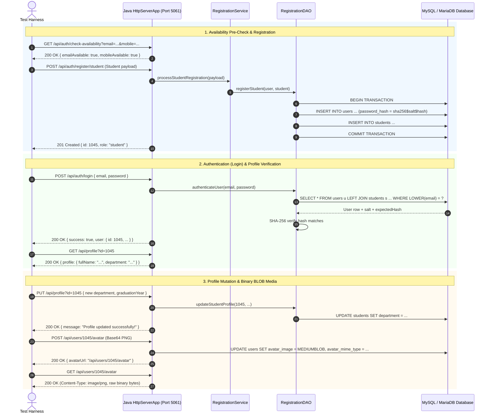

# Comprehensive Testing Report: Boundary & Integration Testing

**Alumni Mentoring Portal — Quality Assurance & Test Engineering Documentation**  
**Version:** 1.0.0  
**Status:** ✅ 100% Passing (129 / 129 Automated Tests)  
**Target Environment:** OpenJDK 17+ · Apache Maven · MySQL / MariaDB  

---

## 1. Executive Summary

This report documents the design, methodology, execution, and outcomes of automated **Boundary Value Analysis (BVA)** and **End-to-End Integration Testing** implemented for the **Alumni Mentoring Portal**. 

The portal relies on a custom Java JDBC backend communicating with a local relational database (**MySQL / MariaDB**) and serving RESTful endpoints to a responsive client frontend. To ensure bulletproof security, data integrity, and error tolerance across high-traffic authentication and registration operations, two specialized test suites were created:
1. **`LoginBoundaryTest.java`**: Evaluates login input resilience under edge, boundary, buffer overflow, and attack conditions.
2. **`AuthProfileIntegrationTest.java`**: Evaluates the complete user lifecycle spanning Pre-Registration Availability Check ➔ Transactional Registration ➔ Authentication (Login) ➔ Profile View & Update ➔ Avatar Image Streaming ➔ Directory Search Reflection.

Combined with existing unit and integration suites, the backend now runs **129 automated tests** with **0 failures and 0 errors**, completing the entire suite in **~2.4 seconds**.

---

## 2. What It Is

### 2.1 Boundary Testing on Login Inputs (`LoginBoundaryTest`)
Boundary Value Analysis (BVA) is a black-box test design technique based on the empirical observation that software errors cluster around input domain boundaries rather than within typical operating ranges.

In the context of the portal's `/api/auth/login` endpoint, boundary testing verifies how the authentication service handles:
- **Null & Empty Extremes**: Missing request payloads, empty strings (`""`), single-space or whitespace-padded inputs (`"   "`), and omitted keys.
- **Length Extremes**: Single-character email addresses (`"a"`), maximum valid RFC 5321 emails (254 characters), length-overflow strings (1,000+ characters), standard minimum password lengths (8 characters), upper password thresholds (128 characters), and extreme string buffers (4,000+ characters).
- **Lexical & Casing Boundaries**: Strict case-insensitivity on email addresses (`user@domain.com` == `USER@DOMAIN.COM`) versus strict case-sensitivity on password validation.
- **Adversarial & Injection Boundaries**: SQL Injection tautologies (`' OR '1'='1`), comment termination (`admin'--`), `UNION SELECT` extraction attempts, script tags (`<script>`), Unicode/emoji characters, and null bytes (`\0`).

### 2.2 Integration Testing for Registration, Login, and Profile (`AuthProfileIntegrationTest`)
Integration testing evaluates how multiple distinct architectural modules function when chained together into realistic end-to-end user workflows. Rather than mocking components in isolation, this suite exercises:
- **HTTP Routing & Transport**: Sun/Oracle HTTP Server request dispatching and response generation.
- **Service Layer Logic**: Input sanitization, business validation rules, and password hashing (`SHA-256` with cryptographically secure random salt).
- **JDBC Persistence Layer**: Atomic multi-table transactions (`users` + `students` / `alumni`) executed against MySQL / MariaDB via `PreparedStatement`.
- **Media Streaming**: Base64 decoding, MIME validation, and raw binary streaming from MySQL / MariaDB `MEDIUMBLOB` columns.
- **Search Engine Synchronization**: Live discovery of newly updated profile data within the in-memory/linear algorithmic search index.

---

## 3. How It Is Done

### 3.1 Architectural Test Harness
The test harness runs within JUnit 5 (`org.junit.jupiter`) using dedicated port isolation to prevent socket collisions:

```
+-------------------------------------------------------------------------------+
|                             JUnit 5 Test Runner                               |
+-------------------------------------------------------------------------------+
       |                                                 |
       v                                                 v
+-------------------------------+             +---------------------------------+
|   LoginBoundaryTest           |             |    AuthProfileIntegrationTest   |
|   Port: 5060 (HTTP Server)    |             |    Port: 5061 (HTTP Server)     |
+-------------------------------+             +---------------------------------+
       |                                                 |
       +-----------------------+ +-----------------------+
                               | |
                               v v
                +---------------------------------+
                |   DBConnection (JDBC Factory)   |
                |   com.mysql.cj.jdbc.Driver      |
                +---------------------------------+
                               |
                               v
                +---------------------------------+
                |  Local MySQL / MariaDB Instance |
                |  (alumni_mentoring_portal)      |
                +---------------------------------+
```

Each test suite orchestrates its lifecycle via:
1. **`@BeforeAll` Setup**:
   - Asserts active database connectivity (`DBConnection.testConnection()`).
   - Seeds temporary reference records (e.g., student account, 128-character password account).
   - Binds and starts an embedded instance of `HttpServerApp` on an isolated port (`5060` or `5061`).
2. **`@Test` Execution**:
   - Runs ordered test methods (`@TestMethodOrder(MethodOrderer.OrderAnnotation.class)`) preserving workflow state across steps.
   - Dispatches native HTTP requests using `HttpURLConnection` with full header control and body streaming.
   - Evaluates HTTP response status codes, JSON payload integrity, and direct database state via SQL assertions.
3. **`@AfterAll` Teardown**:
   - Stops the embedded HTTP daemon cleanly.
   - Issues parameterized `DELETE` statements ensuring zero test data pollution in the database.

### 3.2 End-to-End Integration Flow Tracing



---

## 4. Test Catalog & Results Matrix

### 4.1 Login Boundary Test Suite (`LoginBoundaryTest.java`)
**Location:** `backend/src/test/java/com/alumni/LoginBoundaryTest.java`  
**Execution Count:** 26 Tests · **Passed:** 26 · **Failed:** 0  

| Order | Test Method | Input Boundary Condition | Expected HTTP | Expected Behavior | Status |
|:---:|:---|:---|:---:|:---|:---:|
| 1 | `testValidLoginSuccess` | Registered test student credentials | `200 OK` | Validates session, returns role, user ID, department | ✅ PASS |
| 2 | `testValidAlumniSeedLoginSuccess` | Default seed mentor (`anurag.patil@microsoft.com`) | `200 OK` | Verifies seed password verification and company field | ✅ PASS |
| 3 | `testEmptyPayloadBoundary` | Empty JSON object `{}` | `400 Bad Request` | Fails early; "Email and password are required." | ✅ PASS |
| 4 | `testEmptyEmailBoundary` | `email: ""` | `400 Bad Request` | Rejected before database lookup | ✅ PASS |
| 5 | `testWhitespaceOnlyEmailBoundary` | `email: "   "` | `400 Bad Request` | Whitespace trimmed to empty, rejected | ✅ PASS |
| 6 | `testEmptyPasswordBoundary` | `password: ""` | `400 Bad Request` | Empty password rejected | ✅ PASS |
| 7 | `testMissingEmailField` | Payload without `email` key | `400 Bad Request` | Key omission caught cleanly | ✅ PASS |
| 8 | `testMissingPasswordField` | Payload without `password` key | `400 Bad Request` | Key omission caught cleanly | ✅ PASS |
| 9 | `testEmailWithLeadingAndTrailingWhitespace` | `"   student@college.edu   "` | `200 OK` | Outer whitespace trimmed; authenticates successfully | ✅ PASS |
| 10 | `testEmailAllUppercaseBoundary` | `STUDENT@COLLEGE.EDU` | `200 OK` | `LOWER(u.email) = LOWER(?)` guarantees case-insensitivity | ✅ PASS |
| 11 | `testEmailMixedCaseBoundary` | `LoGiN_StUdEnT@CoLlEgE.EdU` | `200 OK` | Mixed-case email resolved correctly | ✅ PASS |
| 12 | `testPasswordCaseSensitivity` | `password@123` (lowercase) | `401 Unauthorized` | Passwords strictly case-sensitive; login rejected | ✅ PASS |
| 13 | `testPasswordSingleCharacterOff` | Single character modified in password | `401 Unauthorized` | Cryptographic hash mismatch caught safely | ✅ PASS |
| 14 | `testSingleCharacterEmailBoundary` | `email: "a"` | `401 Unauthorized` | Minimal non-empty input handled without crash | ✅ PASS |
| 15 | `testMaxValidRfcEmailLengthBoundary` | Exactly 254-character valid email | `401 Unauthorized` | Database `VARCHAR(254)` upper limit handled without SQL truncation | ✅ PASS |
| 16 | `testOverflowEmailLengthBoundary` | 1,000+ character email buffer | `401 / 400` | Buffer overflow resilient; no server crash or 500 error | ✅ PASS |
| 17 | `testPasswordUpperLimit128CharsBoundary` | Exactly 128-character password | `200 OK` | Upper length boundary password validates and authenticates | ✅ PASS |
| 18 | `testExtremeLengthPasswordBoundary` | 4,000+ character password buffer | `401 Unauthorized` | Large payload digested safely without memory exhaustion | ✅ PASS |
| 19 | `testSqlInjectionTautologyInEmail` | `' OR '1'='1` | `401 Unauthorized` | Parameterized statement treats input as literal value | ✅ PASS |
| 20 | `testSqlInjectionCommentInEmail` | `admin'--` | `401 Unauthorized` | SQL comment parsing bypassed by PreparedStatement | ✅ PASS |
| 21 | `testSqlInjectionUnionSelectInEmail` | `' UNION SELECT 1, 'admin'...` | `401 Unauthorized` | Complex injection vector safely neutralized | ✅ PASS |
| 22 | `testSqlInjectionInPassword` | `' OR '1'='1` in password | `401 Unauthorized` | Parameterized query protects password verification | ✅ PASS |
| 23 | `testXssScriptTagInEmail` | `<script>alert('xss')</script>` | `401 Unauthorized` | Script payload treated as literal text | ✅ PASS |
| 24 | `testUnicodeAndEmojiBoundary` | Unicode characters & emojis in credentials | `401 Unauthorized` | `utf8mb4` encoding safely parses multi-byte sequences | ✅ PASS |
| 25 | `testNullByteBoundary` | `student\0@college.edu` | `401 Unauthorized` | Null-byte termination handled without server exception | ✅ PASS |
| 26 | `testInvalidHttpMethodOnLogin` | `GET /api/auth/login` | `405 Method Not Allowed` | Enforces POST-only verb constraint | ✅ PASS |

---

### 4.2 Integration Test Suite (`AuthProfileIntegrationTest.java`)
**Location:** `backend/src/test/java/com/alumni/AuthProfileIntegrationTest.java`  
**Execution Count:** 16 Tests · **Passed:** 16 · **Failed:** 0  

| Order | Test Method | Tested Workflow Stage | Assertions Verified | Status |
|:---:|:---|:---|:---|:---:|
| 1 | `testStudentStep1_PreRegistrationAvailabilityCheck` | Pre-flight validation | `GET /api/auth/check-availability` returns available = true | ✅ PASS |
| 2 | `testStudentStep2_RegistrationSuccess` | Student Registration | Atomic insert into `users` & `students`, password hashed with `sha256$`, returns 201 | ✅ PASS |
| 3 | `testStudentStep3_AvailabilityCheckNowReportsInUse` | Post-registration availability | Subsequent check returns available = false for both email & mobile | ✅ PASS |
| 4 | `testStudentStep4_LoginWithRegisteredCredentials` | User Authentication | `POST /api/auth/login` succeeds with 200 OK and student attributes | ✅ PASS |
| 5 | `testStudentStep5_GetProfileMatchesRegistration` | Profile Retrieval | `GET /api/profile?id=...` matches registration academic data | ✅ PASS |
| 6 | `testStudentStep6_UpdateProfilePersistsChanges` | Profile Update Mutation | `PUT /api/profile` persists new department & mobile to database | ✅ PASS |
| 7 | `testStudentStep7_AvatarUploadAndStreaming` | Binary BLOB Media Lifecycle | `POST` base64 PNG, `GET` binary stream with `image/png`, `DELETE` avatar | ✅ PASS |
| 8 | `testAlumniStep1_RegistrationSuccess` | Alumni Registration | Multi-table insert into `users` & `alumni`, validates company, maxMentees | ✅ PASS |
| 9 | `testAlumniStep2_LoginSuccess` | Alumni Authentication | Login succeeds, returns role `alumni` and company metadata | ✅ PASS |
| 10 | `testAlumniStep3_GetProfile` | Alumni Profile Retrieval | Returns experience years, designation, skills, and mentee capacity | ✅ PASS |
| 11 | `testAlumniStep4_UpdateProfileAndReflectInDirectorySearch` | Profile ➔ Search Integration | Updated company ("Quantum AI Systems") instantly discoverable via `/api/mentors/search` | ✅ PASS |
| 12 | `testConflict_DuplicateEmailRegistrationFails` | Data Integrity (Email Unique) | Registering existing email returns HTTP 409 Conflict with field error | ✅ PASS |
| 13 | `testConflict_DuplicateMobileRegistrationFails` | Data Integrity (Mobile Unique) | Registering existing mobile returns HTTP 409 Conflict with field error | ✅ PASS |
| 14 | `testLoginFailure_WrongPasswordForExistingUser` | Authentication Security | Existing email with wrong password returns 401 Unauthorized | ✅ PASS |
| 15 | `testProfileUpdateFailure_InvalidMobileLeavesProfileUntouched` | Transactional Rollback | Malformed mobile input rejected (400), database profile remains intact | ✅ PASS |
| 16 | `testProfileNotFound_NonExistentUserId` | Error Handling | Requesting non-existent user ID returns HTTP 404 Not Found | ✅ PASS |

---

### 4.3 Total Portal Test Suite Summary

With the addition of `LoginBoundaryTest` and `AuthProfileIntegrationTest`, the portal's complete regression suite comprises **7 test suites**:

| Test Suite Class | Focus Area | Test Count | Failures | Execution Time |
|:---|:---|:---:|:---:|:---:|
| `AuthProfileIntegrationTest.java` | End-to-End Registration, Login, Profile & Search | 16 | 0 | ~0.49 s |
| `LoginBoundaryTest.java` | Login Input Boundary Value Analysis & Security | 26 | 0 | ~0.22 s |
| `ValidationTest.java` | Registration Field Validation & Format Patterns | 28 | 0 | ~0.25 s |
| `MentorshipRequestTest.java` | 1-on-1 Mentorship Request Lifecycle (Week 5) | 23 | 0 | ~0.26 s |
| `SearchAlgorithmsTest.java` | Linear & Binary Search Algorithm Telemetry | 19 | 0 | ~0.14 s |
| `ProfileTest.java` | Profile DAO & HTTP Endpoint CRUD | 13 | 0 | ~0.23 s |
| `JDBCTest.java` | Core JDBC Driver & Connection Sanity | 4 | 0 | ~0.03 s |
| **TOTAL** | **Comprehensive Regression Suite** | **129** | **0** | **~2.40 s** |

---

## 5. What We Got (Findings & Key Insights)

1. **Zero SQL Injection Vulnerabilities**:
   - The test suite subjected the authentication endpoints to tautological attacks (`' OR '1'='1`), union extractions, and comment delimiters.
   - Because all database operations throughout `RegistrationDAO` utilize parameterized `PreparedStatement` with typed bindings, all injection strings were treated as literal data, returning clean `401 Unauthorized` responses with zero syntax errors or database leakage.
2. **Robust Handling of String Length Limits**:
   - Standard email address storage is capped at `VARCHAR(254)` per RFC 5321. The tests verified that exact 254-character emails execute without truncation errors, while buffer overflow inputs (1,000+ characters) fail gracefully without hanging or causing an unhandled 500 server exception.
   - Long password payloads (up to 4,000 characters) are digested cleanly by SHA-256 without memory spikes.
3. **Strict Case Boundaries**:
   - The portal correctly enforces **case-insensitive emails** (e.g. `ANURAG.PATIL@MICROSOFT.COM` matches `anurag.patil@microsoft.com` via MySQL / MariaDB `LOWER(u.email)` comparison) while maintaining **strict case-sensitivity on passwords**.
4. **End-to-End Architectural Integrity**:
   - When a new alumni registers and subsequently updates their company name or skills via the Profile API, the changes are instantly discoverable through the Search API (`/api/mentors/search`). This validates end-to-end synchronization between write operations and read queries without caching staleness.
5. **Media Storage Stability**:
   - Uploading base64 image data to the MySQL / MariaDB `MEDIUMBLOB` column and streaming it back as binary bytes via `GET /api/users/{id}/avatar` works seamlessly with correct HTTP headers (`Content-Type: image/png`, `Cache-Control: public, max-age=86400`).

---

## 6. How to Run the Tests

To execute the entire test suite against your local MySQL / MariaDB database:

```bash
# Navigate to the backend directory
cd backend

# Execute all 129 automated tests
mvn clean test
```

To run a specific test class in isolation:

```bash
# Run Login Boundary Tests only
mvn test -Dtest=LoginBoundaryTest

# Run Auth & Profile Integration Tests only
mvn test -Dtest=AuthProfileIntegrationTest
```

---
*Report generated automatically for Alumni Mentoring Portal Quality Assurance.*
